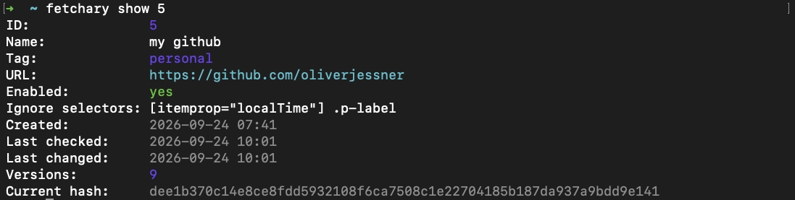
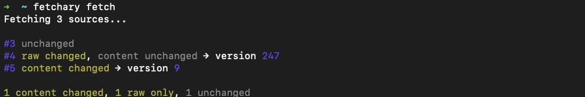
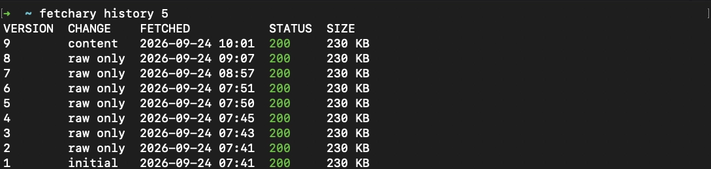
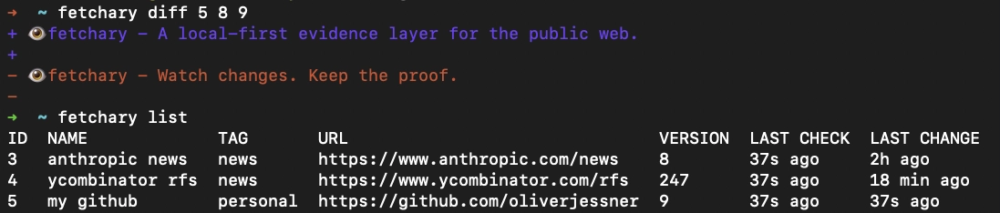

# Fetchary

<p align="center">
  
</p>

> **A local-first evidence layer for the public web.**

Fetchary monitors public web resources and preserves both what the server returned and what a real browser rendered.

Every response body is stored byte-for-byte and hashed with SHA-256. For HTML pages, Fetchary also renders the page with its bundled Chromium, archives the resulting DOM separately, and detects changes in that rendered content.

Ignore dynamic DOM elements during comparison without altering the archived evidence.

Fetchary works as both a command-line tool and a Node.js library. Both interfaces use the same core, SQLite database, archive, change detector, and scheduler.

```text
URL
 ├── HTTP fetch ── exact response bytes ── raw SHA-256
 └── Chromium ── load + 5s ── rendered DOM ── rendered SHA-256
                                      └── temporary filtered DOM ── comparison SHA-256
```

No cloud account. No proprietary storage. No rewriting of captured content.

## Why Fetchary?

Web pages change.

Statements get edited. Documents disappear. Product pages are updated. Terms change. Public records are replaced.

Traditional monitoring tools usually tell you **that something changed**.

Fetchary also keeps **what was actually returned**.

Each archived version contains the exact response bytes used to calculate its SHA-256 hash. This makes captures reproducible and independently verifiable after the original resource has changed or disappeared.

Fetchary is deliberately small. Chromium is used only as a deterministic rendering step: wait for `load`, wait another five seconds by default, then capture `page.content()`. Fetchary intentionally does not use `networkidle`, which is unreliable on pages with analytics, polling, ads, or WebSockets.

For public Threads pages, Fetchary declines the optional-cookie prompt when it
appears during that wait, so the consent dialog does not cover the archived
DOM. This does not sign in or bypass Threads' logged-out content limits.
Site-specific overlay handling lives in `src/vendors/`; add another vendor
module and register it in `src/vendors/index.js` to support another website.
The X vendor refuses non-essential cookies and closes X login dialogs before
the rendered DOM is archived. Before navigation, it also uses Chromium's normal
browser User-Agent because X rejects the `HeadlessChrome` token. It does not
sign in or bypass access controls.

## Core principles

### Local-first

Your database and archived responses stay on your machine.

By default Fetchary stores its data in:

```text
~/.fetchary/
├── fetchary.sqlite
└── pages/
```

No account or external service is required.

### Byte-exact archiving

Fetchary does not clean, normalize, parse, or rewrite a response before archiving it.

The bytes written to disk are the same bytes used to calculate the SHA-256 hash.

### Change-aware

A new version is created when either the exact response body or the rendered DOM changes.

Repeated identical responses update the source's last-check time without duplicating the archived content.

Per-source CSS ignore selectors can remove timestamps, counters, and other noisy
elements from a temporary comparison DOM. Raw responses, rendered archives,
their hashes, and raw diffs are never filtered.

### Independently verifiable

Exports include archived versions, metadata, and SHA-256 hashes.

You can verify a capture using standard system tools:

```bash
shasum -a 256 fetchary-export-12/versions/001-response.html
shasum -a 256 fetchary-export-12/versions/001-rendered.html
```

### Composable

Use Fetchary interactively from the terminal, run it continuously as a monitor, call it from cron or CI, or embed it directly into a Node.js application.

## Installation

Fetchary requires Node.js 26.0 or newer.
Installing Fetchary also downloads Puppeteer's bundled Chrome for Testing; no
system Chrome installation or executable-path configuration is required.

### npm library

```bash
npm install fetchary
```

### CLI

```bash
npm install --global fetchary
fetchary --version
```

### Homebrew

```bash
brew tap oliverjessner/tap
brew install fetchary
fetchary --version
```

## Quick start

Add a public web resource:

```bash
fetchary add https://example.com/news \
  --name "Example News" \
  --tag research
```

Ignore dynamic elements when deciding whether visible content changed:

```bash
fetchary add https://github.com/owner/repo \
  --ignore-selector "relative-time" \
  --ignore-selector ".timestamp"
```

New sources default to browser mode for HTML. Use HTTP-only capture for APIs,
feeds, binary resources, or lightweight server-response monitoring:

```bash
fetchary add https://example.com/api/status --mode http
fetchary edit 1 --mode browser --wait-after-load 10s
```

Fetch it:

```bash
fetchary fetch
```

Check its history:

```bash
fetchary history 1
```

Compare two versions:

```bash
fetchary diff 1
fetchary diff 1 --element-content
fetchary diff 1 --element-raw
```

Export the evidence:

```bash
fetchary export 1 --output ./research
```

## CLI preview

### Show source details



### Fetch monitored sources



### Inspect version history



### Compare and list versions



## Monitoring

Sources can be checked manually or on a persistent schedule.

```bash
fetchary schedule 1 15m
fetchary run
```

Supported intervals use minutes, hours, or days:

```text
15m
2h
3d
```

The minimum interval is one minute.

Schedules are persisted in SQLite.

Only one Fetchary runner may manage a data directory at a time. Fetch failures are isolated and do not stop the runner.

## CLI

```text
fetchary add <url> [--name <name>] [--tag <tag>] [--every <interval>] [--mode <browser|http>] [--wait-after-load <duration>] [--ignore-selector <css> ...]
fetchary list [--tag <tag>] [--json]
fetchary fetch [id...]
fetchary status
fetchary show <id>
fetchary history <id> [--json]
fetchary diff <id> [from to] [--element-content|--element-raw|--raw] [--html]
fetchary open <id> [version] [--html] [--raw]
fetchary edit <id> [--url <url>] [--name <name>] [--tag <tag>] [--mode <browser|http>] [--wait-after-load <duration>] [--ignore-selector <css> ... | --clear-ignore-selectors]
fetchary enable <id>
fetchary disable <id>
fetchary remove <id> [--purge]
fetchary export <id> [--output <directory>]
fetchary schedule <id> <interval> [--now]
fetchary unschedule <id>
fetchary schedules [--json]
fetchary run [--poll-interval <milliseconds>]
```

Global flags:

```text
--json
--quiet
--verbose
--no-color
--help
--example
--version
--data-dir
```

`FETCHARY_DATA_DIR` can also be used to select a custom storage directory.

Run:

```bash
fetchary --example
```

for common CLI examples.

### Exit codes

Fetchary's exit codes are suitable for shell scripts, cron jobs, and CI pipelines.

| Code | Meaning                               |
| ---: | ------------------------------------- |
|  `0` | Success; no change detected           |
|  `1` | General error                         |
|  `2` | Invalid arguments or validation error |
|  `3` | HTTP fetch failed                     |
| `10` | At least one fetched resource changed |

This makes workflows such as this possible:

```bash
fetchary fetch || {
  code=$?

  if [ "$code" = "10" ]; then
    echo "A monitored resource changed."
  fi
}
```

## Node.js library

Fetchary can also be embedded directly into an application.

```js
import { createFetchary } from 'fetchary';

const fetchary = await createFetchary();

const source = await fetchary.add('https://example.com/news', {
    name: 'Example News',
    tag: 'research',
    every: '30m',
    mode: 'browser',
    waitAfterLoad: '5s',
    ignoreSelectors: ['relative-time', '.timestamp'],
});

const result = await fetchary.fetch(source.id);

console.log(result.changed);
console.log(result.hash);
console.log(result.renderedHash);

await fetchary.close();
```

CommonJS is supported as well:

```js
const { createFetchary } = require('fetchary');
```

By default the CLI and library share:

```text
~/.fetchary
```

Use a separate location when needed:

```js
const fetchary = await createFetchary({
    dataDir: './data/fetchary',
    timeout: 15_000,
    userAgent: 'MyResearchBot/1.0',
    fetch: customFetch,
});
```

The optional Fetch-compatible implementation makes proxies, tests, and custom HTTP handling deterministic.

## Public API

The instance returned by `createFetchary()` exposes:

### Sources

```text
add
list
get
edit
enable
disable
remove
```

### Fetching and archives

```text
fetch
history
version
read
readRendered
diff
export
```

### Scheduling

```text
schedule
unschedule
schedules
run
```

### Lifecycle and events

```text
on
close
```

Fetch one source:

```js
await fetchary.fetch(12);
```

Fetch selected sources:

```js
await fetchary.fetch([12, 14, 18]);
```

Fetch all enabled sources:

```js
await fetchary.fetch();
```

Read and compare archived versions without contacting the live website:

```js
const html = await fetchary.read(12, 4);
const renderedHtml = await fetchary.readRendered(12, 4);

const latestTextDiff = await fetchary.diff(12);

const latestElementContentDiff = await fetchary.diff(12, {
    mode: 'element-content',
});

const latestElementRawDiff = await fetchary.diff(12, {
    mode: 'element-raw',
});

const rawDiff = await fetchary.diff(12, {
    from: 3,
    to: 4,
    mode: 'raw',
});
```

All public TypeScript declarations ship with the package.

Typed errors include:

```text
FetcharyFetchError
FetcharyBrowserError
FetcharyNotFoundError
FetcharyIntervalError
FetcharyStorageError
FetcharyValidationError
FetcharyRunnerError
```

## Events and hooks

Fetchary can become part of larger collection and monitoring pipelines.

```js
fetchary.on('fetch', result => {
    console.log('checked', result.sourceId);
});

fetchary.on('change', result => {
    console.log('changed', result.sourceId);
});

fetchary.on('version', version => {
    console.log('archived', version.file);
});

fetchary.on('fetch:error', event => {
    console.error(event.sourceId, event.error);
});
```

Available events include:

```text
fetch:start
fetch
change
version
fetch:error
scheduler:start
scheduler:stop
```

A conventional `error` event is also emitted when a listener is registered.

Lifecycle hooks can be supplied through:

```text
hooks.beforeFetch
hooks.afterFetch
hooks.onChange
hooks.onError
```

Hook failures never roll back or prevent an archive operation.

## Storage model

Fetchary separates metadata from captured content.

```text
~/.fetchary/
├── fetchary.sqlite
└── pages/
    └── <source-id>/
        └── <version-number>/
            ├── response.html
            ├── rendered.html
            └── metadata.json
```

SQLite stores source, version, and schedule metadata.

Captured response bodies and rendered DOMs remain ordinary files on disk.

The SHA-256 hash is calculated from the exact same `Buffer` written to `response.html`.

`response.html` is always the byte-exact HTTP body. `rendered.html`, when present,
is the UTF-8 DOM returned by Puppeteer's `page.content()`. HTTP-only and clearly
non-HTML resources do not create a rendered file.

Change detection tracks raw, rendered, and comparison hashes independently. The
comparison DOM is built from rendered HTML when available, otherwise from the
HTTP document. Ignore selectors are removed only from this temporary DOM.

## Evidence exports

Fetchary can export a source into a self-contained directory:

```text
fetchary-export-12/
├── metadata.json
├── hashes.txt
└── versions/
    ├── 001-response.html
    ├── 001-rendered.html
    └── 002-response.html
```

The archived files can be inspected without Fetchary and verified independently:

```bash
shasum -a 256 fetchary-export-12/versions/001-response.html
```

This makes the archive portable instead of tying evidence to a proprietary database or application.

## Removing sources

By default, removing a source stops monitoring it but preserves its archive.

```bash
fetchary remove 12
```

To permanently remove both metadata and archived files:

```bash
fetchary remove 12 --purge
```

The library equivalent is:

```js
await fetchary.remove(12, { purge: true });
```

## What Fetchary is not

Fetchary intentionally does not try to be a crawler or general browser automation framework.

It does not currently provide:

- screenshots
- crawling
- clicking, login/session management, or user scripts
- AI analysis
- cloud accounts
- notifications

Chromium is limited to loading monitored HTML pages and snapshotting their DOM.
For screenshots, authenticated sessions, interactive automation, or large-scale
crawling, dedicated browser automation or archiving systems remain a better fit.

## Fetchary vs. a traditional change detector

A traditional change detector usually answers:

> Did this page change?

Fetchary is designed to answer:

> What exactly did this endpoint return, when did its contents change, and can I still inspect and verify the archived versions later?

That distinction is the core of the project.

## Development

```bash
npm test
npm run test:coverage
```

The test suite covers:

- exact-byte archiving and hashing
- JavaScript rendering with local Chromium
- separate raw, rendered, and comparison hashes
- browser lifecycle and failure cleanup
- changed and unchanged fetches
- source lifecycle
- exports
- typed failures
- interval parsing
- persisted schedules
- scheduler locking
- core events
- CLI JSON output
- documented exit codes

## Documentation

Detailed behavior is documented in:

- [`docs/LIBRARY.md`](docs/LIBRARY.md)
- [`docs/CLI.md`](docs/CLI.md)
